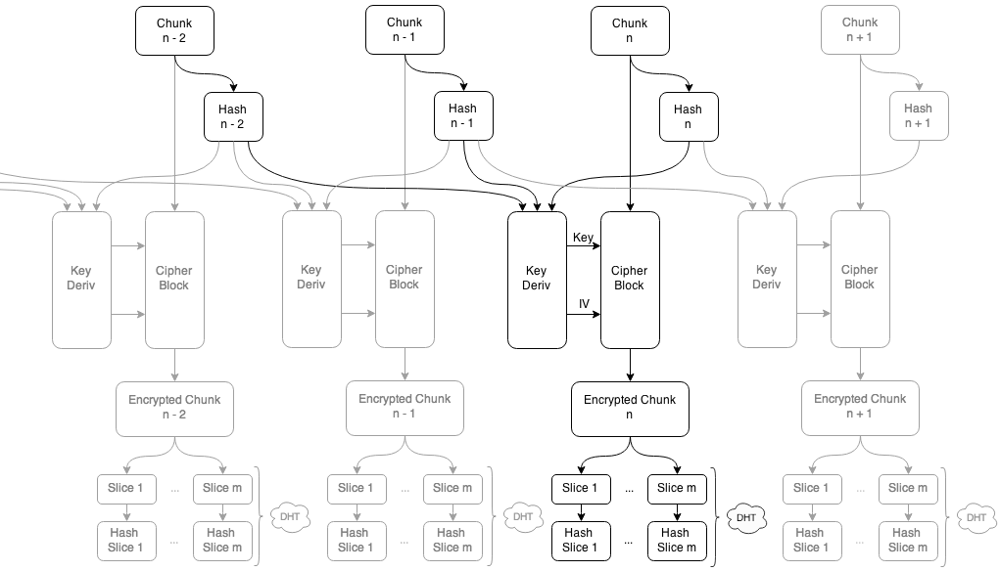

Distributed Cloud Simulation
=======

Algorithm based on [Maidsafe](http://maidsafe.net/)

    ##########################
    ## Maidsafe Interpreter ##
    ##########################

    Usage: [option] <file>

    Options: -s   Send file on network.
             -g   Get file from network. Input file must be a hash list.

    Optionnal:
             -l  Local port to use. Default 5678.
             -i  Bootstrap IP address. Default 127.0.0.1
             -p  Bootstrap port. Default 8450.
             -d  Print debug log. wee < normal < loads. Default wee.

    ##########################

1. Start backbone kad server : `twistd -noy kademlia/examples/server.tac`
2. Open a new terminal
3. Send file : `./main.py -s yourfile.png`
4. Get file  : `./main.py -g yourfile.png.hashes`

The initial algorithm has been slightly changed to increase network performance. It is described in the following schematic.

Note that the verbose option is, well, _very_ verbose.

    joe@joe:~/Desktop/maidsafe$ ./main.py -l 5678 -i 127.0.0.1 -p 8450 -d wee -s wind.mp3
    ##########################
    ## Maidsafe Interpreter ##
    ##########################

      Local port 5678
      Bootstraping on IP address 127.0.0.1
      Bootstraping on port 8450
      Printing a wee debug log.
      Sending file wind.mp3
      Computing Shas...
      Cipherin'
      Splitting chunks in smaller slices.
      Resizing Factor >> 524
      File Sent !
      Note that if you delete your .hashes file and your initial file, it will be lost in the ciphernetic ether...

    joe@joe:~/Desktop/maidsafe$ ./main.py -l 5678 -i 127.0.0.1 -p 8450 -d wee -g wind.mp3.hashes

    ##########################
    ## Maidsafe Interpreter ##
    ##########################

      Local port 5678
      Bootstraping on IP address 127.0.0.1
      Bootstraping on port 8450
      Printing a wee debug log.
      Getting file wind.mp3.hashes
      Downloading chunks from DHT...
      Chunks downloaded from DHT!
      Decrypting...
      File successfully downloaded!

    joe@joe:~/Desktop/maidsafe$

4th year project - University of Strathclyde
