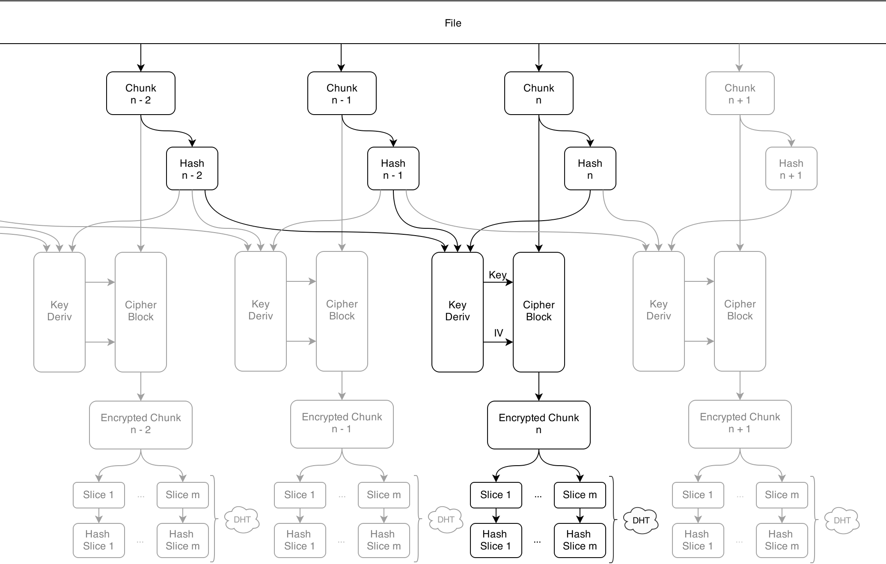

Maidsafe-like network in python
=======

    ##########################
    ## Maidsafe Interpreter ##
    ##########################

    Usage: [option] <file>

    Options: -s   Send file on network.
             -g   Get file from network. Input file must be a hash list.

    Optionnal:
             -l  Local port to use. Default 5678.
             -i  Bootstrap IP address. Default 127.0.0.1
             -p  Bootstrap port. Default 8450.
             -d  Print debug log. wee < normal < loads. Default wee.

    ##########################

### Introduction
[Maidsafe](http://maidsafe.net/)-like network implemented in python. The initial algorithm has been slightly modified to increase performance. It is described in the following schematic.

### How to start an instance
1. Install deps : `pip install kademlia twisted pycrypto`
2. Start backbone kad server : `twistd -noy kademlia/examples/server.tac`
3. Open a new terminal
4. Send file : `./main.py -s yourfile.png`
5. Get file  : `./main.py -g yourfile.png.hashes`

The reconstructed file will be in reconstructed/. scrambled/ is the (necessary) local temp file. It should clean itself after use. Some extra options are available (see help). Note that the verbose option is, well, _very_ verbose.

Fancy call graph : `pycallgraph --max-depth 5 graphviz -- ./main.py -s wind.mp3`

    joe@joe:~/Desktop/maidsafe$ ./main.py -l 5678 -i 127.0.0.1 -p 8450 -d wee -s wind.mp3

    ##########################
    ## Maidsafe Interpreter ##
    ##########################

      Local port 5678
      Bootstraping on IP address 127.0.0.1
      Bootstraping on port 8450
      Printing a wee debug log.
      Sending file wind.mp3
      Computing Shas...
      Cipherin'
      Splitting chunks in smaller slices.
      Resizing Factor >> 524
      File Sent !
      Note that if you delete your .hashes file and your initial file, it will be lost in the ciphernetic ether...

    joe@joe:~/Desktop/maidsafe$ ./main.py -l 5678 -i 127.0.0.1 -p 8450 -d wee -g wind.mp3.hashes

    ##########################
    ## Maidsafe Interpreter ##
    ##########################

      Local port 5678
      Bootstraping on IP address 127.0.0.1
      Bootstraping on port 8450
      Printing a wee debug log.
      Getting file wind.mp3.hashes
      Downloading chunks from DHT...
      Chunks downloaded from DHT!
      Decrypting...
      File successfully downloaded!

    joe@joe:~/Desktop/maidsafe$

4th year project - University of Strathclyde
